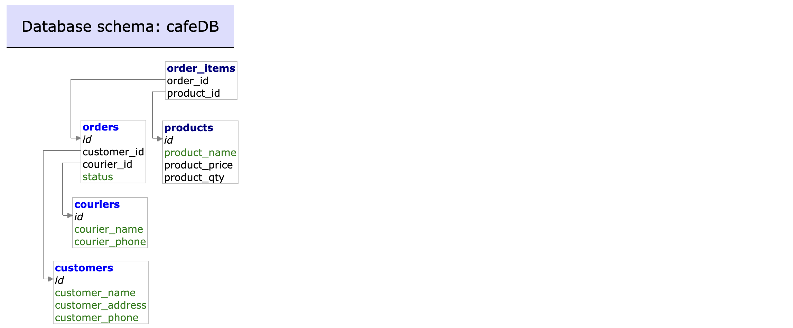

# CafeApp

## 💡 About the project

CafeApp is an application for a pop-up cafe that allows to create orders for customers. It stores data in  MySQL database. Users can perform CRUD operations on their data that consists of customers, products, couriers and orders tables.
Data can be imported from CSV file (where collunms correspond with the respective table columns) and exported from database to a CSV file.




## 🎯 Goals

As a business:

I want to maintain a collection of products & couriers \
When a customer makes a new order, I need to create it on the system \
I need to be able to update the status of an order \
When I exit the app, I need all data to be persisted \
When I start the app, I need to load all persisted data \
I want to be sure the app has been tested & proven to work well \

## 🛠 Installation

Install:

•[Pip](https://pip.pypa.io/en/stable/)\
•[Python3](https://www.python.org/downloads/)\
•[Docker](https://www.docker.com/products/docker-desktop/)

Create and activate virtual environment (Unix/MacOS):
```bash
python3 -m venv .venv
source .venv/bin/activate
```
Install the requirements:
```bash
pip install -r requirements.txt
```
Create Docker containers mysql_container and adminer_container
```bash
docker-compose up -d
```

## 🚀 Getting started

1. Navigate to the following URL http://localhost:8080/; 
2. Use your credentials to login;
3. Run SQL queries:

```sql
CREATE DATABASE mini-project;
```
```sql
CREATE TABLE products (
    id INT AUTO_INCREMENT PRIMARY KEY,
    product_name VARCHAR(255) NOT NULL, 
    product_price DECIMAL, 
    product_qty INT
);
```
```sql
CREATE TABLE customers (
    id INT AUTO_INCREMENT PRIMARY KEY,
    customer_name VARCHAR(255) NOT NULL, 
    customer_address VARCHAR(255) NOT NULL, 
    customer_phone VARCHAR(20) NOT NULL
);
```
```sql
CREATE TABLE couriers (
    id INT AUTO_INCREMENT PRIMARY KEY,
    courier_name VARCHAR(255) NOT NULL, 
    courier_phone VARCHAR(20) NOT NULL
);
```
```sql
CREATE TABLE orders (
    id INT AUTO_INCREMENT PRIMARY KEY,
    customer_id INT, 
    courier_id INT,
    status VARCHAR(255),
    FOREIGN KEY (customer_id) REFERENCES customers (id),
    FOREIGN KEY (courier_id) REFERENCES couriers (id)
);
```
```sql
CREATE TABLE order_items (
    order_id INT,
    product_id INT,
    FOREIGN KEY (order_id) REFERENCES orders (id),
    FOREIGN KEY (product_id) REFERENCES products (id)
);
```

## 👩‍💻 Usage

Navigate through the application by choosing one of the options of te main menu:
```
0 Exit
1 Products
2 Couriers
3 Customers
4 Orders

Please enter an option: <your input>
```
Coose option in the submenu (e.g.):
```
0 Return to the main menu
1 View product list
2 Create a new product
3 Update an existing product
4 Delete product
5 Export data
6 Import data

Please enter an option: <your input>
```


## 🔬 Testing
```bash
$ pytest tests.py -v
```
